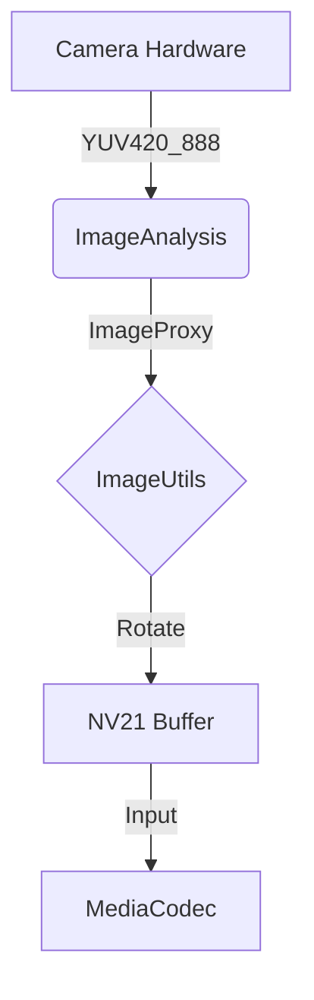

# Android Capture & Encoding Architecture

The Android side of DroidV4L2 is more than a simple streamer; it's a precision-tuned real-time video processing pipeline.

## 📷 CameraX Data Flow

We leverage Google Jetpack CameraX library to acquire the most stable camera feed.

### Key Optimizations
1.  **Direct Memory Access**: We reuse `ByteBuffer` as much as possible to minimize GC pauses caused by heap allocations.
2.  **Color Space Conversion**: Native `YUV420_888` from camera is efficiently converted to `NV21` or `I420` compatible formats before encoding.

## 🎬 MediaCodec Async Encoding

To achieve millisecond-level latency, we use `MediaCodec` in Async Callback mode, rather than the traditional synchronous loop.

-   **Bitrate Mode**: `BITRATE_MODE_CBR` (Constant Bitrate) ensures predictable bandwidth usage.
-   **Low Latency Flag**: Enabled `KEY_LATENCY = 0` for API 26+ devices.
-   **I-Frame Interval**: Forced to 1 second to ensure quick recovery from artifacts.

## 📡 PacketDuplicator Broadcasting

Encoded H.264/H.265 NAL units are not sent directly; they enter a broadcast bus.

`PacketDuplicator` allows multiple streaming protocols to run simultaneously:
1.  **SRT Service**: For high-speed, packet-loss resistant transport.
2.  **RTSP Service**: For direct preview via VLC or OBS.
3.  **HTTP MJPEG**: As a fallback debug stream.

All services share the same encoded data copy, resulting in extremely low CPU usage.
