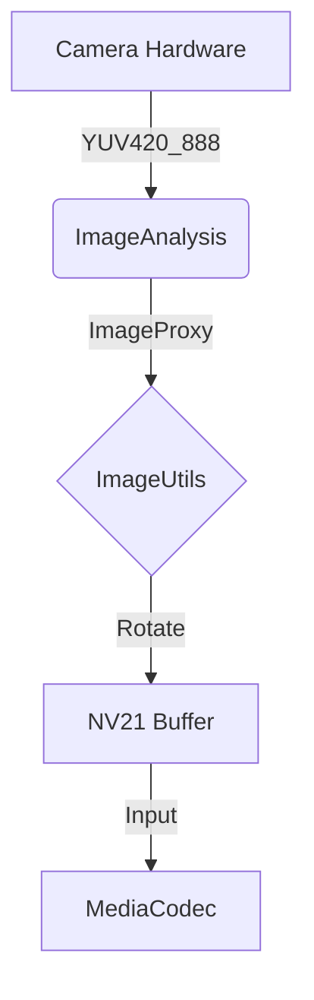

# Android 采集与编码架构

DroidV4L2 的 Android 端不仅仅是一个简单的推流器，它是一个经过精密调优的实时视频处理管道。

## 📷 CameraX 数据流

我们采用 Google Jetpack CameraX 库来获取最稳定的相机数据流。

### 关键优化点
1.  **直接内存访问**: 我们尽可能复用 `ByteBuffer`，减少 Java 堆内存分配造成的 GC 停顿。
2.  **色彩空间转换**: 摄像头的原生 `YUV420_888` 格式在送入编码器前被高效转换为 `NV21` 或 `I420` 兼容格式。

## 🎬 MediaCodec 异步编码

为了实现毫秒级延迟，我们使用了 `MediaCodec` 的异步回调模式（Async Callback），而不是传统的同步循环。

-   **比特率模式**: `BITRATE_MODE_CBR` (Constant Bitrate) 确保网络带宽占用的可预测性。
-   **低延迟标志**: 针对 API 26+ 设备，开启 `KEY_LATENCY = 0`。
-   **I 帧间隔**: 强制设为 1秒，确保画面损坏时能快速恢复。

## 📡 PacketDuplicator 广播系统

编码后的 H.264/H.265 NAL 单元并不是直接发送出去，而是进入了一个广播总线。

`PacketDuplicator` 允许同时运行多种推流协议：
1.  **SRT 服务**: 处理高速、抗丢包传输。
2.  **RTSP 服务**: 供 VLC 或 OBS 直接拉流预览。
3.  **HTTP MJPEG**: 作为保底的调试流。

所有服务共享同一份编码数据拷贝，CPU 占用极低。
