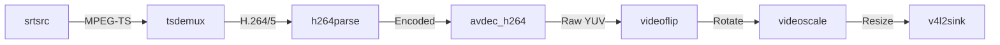

# Linux GStreamer Pipeline In-Depth

The core of the Linux Bridge is a dynamically constructed GStreamer pipeline. It handles receiving the network stream, decoding, processing, and emulating a local camera via the V4L2 driver.

## 🔗 Full Pipeline Chain

Here is a diagram of the typical SRT -> V4L2 pipeline:

## 🧩 Key Component Analysis

### 1. Network Source
-   **srtsrc**: Receives data using the SRT protocol.
    -   `mode=listener`: Waits for phone connection.
    -   `latency=20`: Extremely low receive buffer (20ms), key to low latency.
    -   `poll-timeout=100`: Fast disconnection detection.

### 2. Video Decoding
-   **tsdemux**: Strips the MPEG-TS container.
-   **avdec_h264 / avdec_h265**:
    -   `max-threads=4`: Enables multi-threaded slice decoding.
    -   `output-corrupt=false`: Discards broken frames to prevent visual glitches.

### 3. Post-Processing
-   **videoflip**: `method=clockwise`. Critical because phones usually stream raw frames sideways. We correct it on Linux to save phone CPU.
-   **videoscale**: Forces output to 1920x1080 to match V4L2 capabilities.

### 4. Virtual Device (Sink)
-   **v4l2sink**: Writes to `/dev/video*`.
    -   `device=/dev/video10`: Target device node.
    -   `sync=false`: Disables clock synchronization to render as fast as possible.

## ⚠️ Common Errors

> **"Internal data stream error"**
>
> Usually means the V4L2 device doesn't support the pipeline's output format (e.g., I420 vs NV12). We explicitly add `video/x-raw,format=I420` caps filter to force negotiation.
