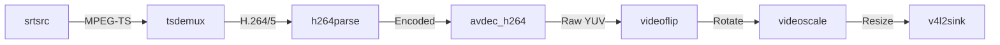

# Linux GStreamer 管道详解

Linux Bridge 的核心是一个动态构建的 GStreamer 管道。它负责接收网络数据流，解码，处理，并通过 V4L2 驱动模拟为本地摄像头。

## 🔗 pipeline 完整链路

以下是典型的 SRT -> V4L2 管道示意图：

## 🧩 关键组件解析

### 1. 网络接收 (Source)
-   **srtsrc**: 使用 SRT 协议接收数据。
    -   `mode=listener`: 作为服务端等待手机连接。
    -   `latency=20`: 极低的接收缓冲（20ms），这是低延迟的关键。
    -   `poll-timeout=100`: 快速断线检测。

### 2. 解码 (Decoder)
-   **tsdemux**: 将 MPEG-TS 容器剥离。
-   **avdec_h264 / avdec_h265**:
    -   `max-threads=4`: 开启多线程切片解码，充分利用多核 CPU。
    -   `output-corrupt=false`: 丢弃损坏帧，防止花屏（虽然会造成卡顿，但比花屏体验好）。

### 3. 后处理 (Post-Processing)
-   **videoflip**: `method=clockwise`。这至关重要，因为手机竖屏拍摄的原始画面通常是横向存储的。我们在 Linux 端进行纠正，减轻手机端的旋转计算压力。
-   **videoscale**: 确保输出画面强制缩放为 1920x1080，匹配 V4L2 设备的宣称能力。

### 4. 虚拟设备 (Sink)
-   **v4l2sink**: 写入 `/dev/video*`。
    -   `device=/dev/video10`: 指定目标设备节点。
    -   `sync=false`: 禁用时钟同步，以最快速度渲染，进一步降低延迟。

## ⚠️ 常见报错分析

> **"Internal data stream error"**
>
> 通常意味着 V4L2 设备不支持管道输出的格式（如 I420 vs NV12）。我们在管道中显式添加了 `video/x-raw,format=I420` 过滤器来强制协商。
